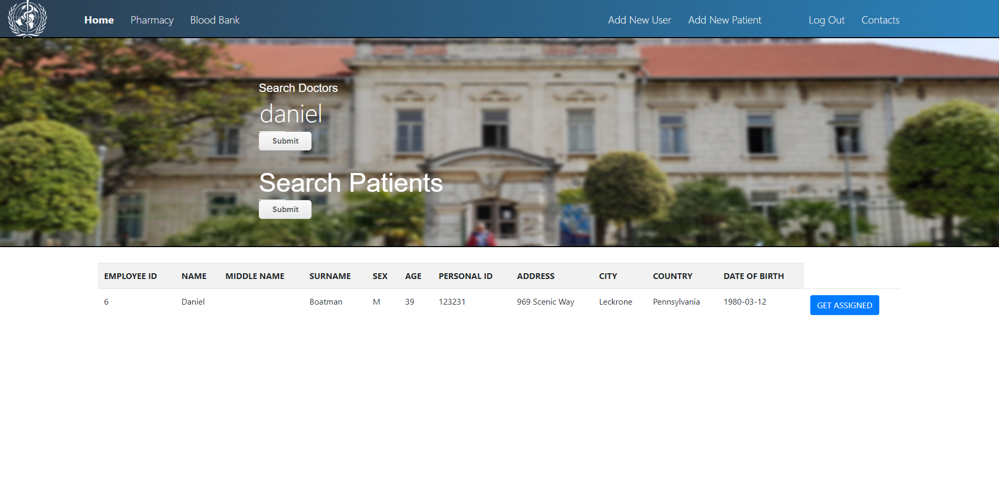

# HospitalDB

A hospital database program connecting the databases of three separate units inside a hospital:
    
- patients and doctors

    
- the pharmacy

    
- the blood bank

Created using XAMPP, only for the purpose of presentation.

